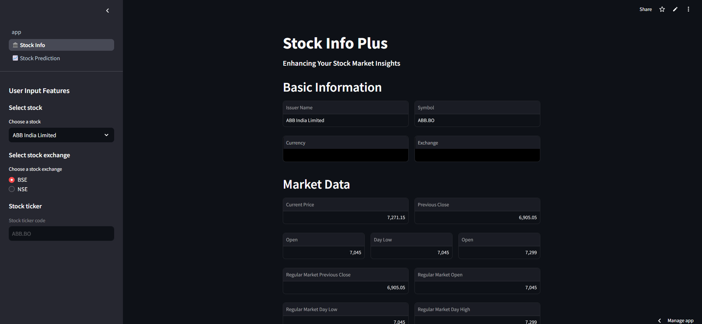
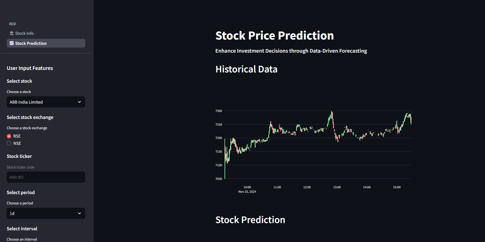
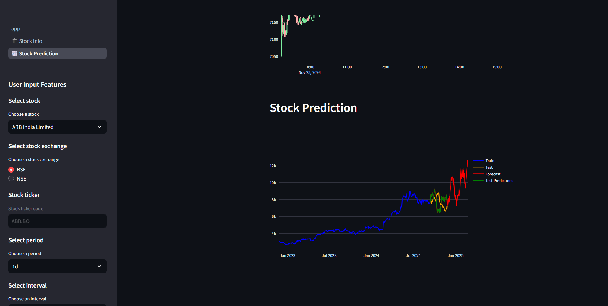

# StockAlysis

### **Team Members**
1) **Saahil A Vishwakarma**
2) **Vrashabha Nilajagi**

**StockAlysis** is a stock market analysis and prediction web application. The project provides insights into stock market trends, historical data visualization, and stock price predictions. It likely leverages financial APIs such as **Yahoo Finance (yfinance)** to fetch real-time stock data and apply analytical methods for forecasting trends.

**The platform features:**
1) Stock Information: Displays key financial data of stocks.
2) Historical Data Analysis: Graphical representation of past stock performance.
3) Stock Price Prediction: Uses predictive models to forecast future stock prices.

### **Project Status** 
Concluded

### **Website Preview**
- **Stock Info**
  

    
  

- **Stock historical data analysis graph**
  

    
  

- **Stock prediction graph**
  

        
  

